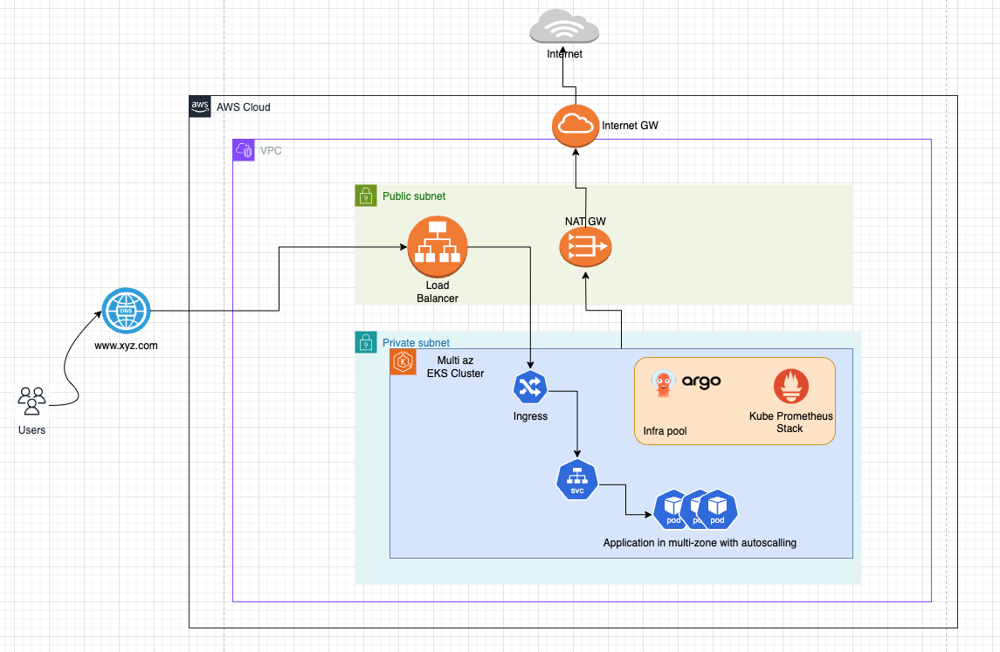
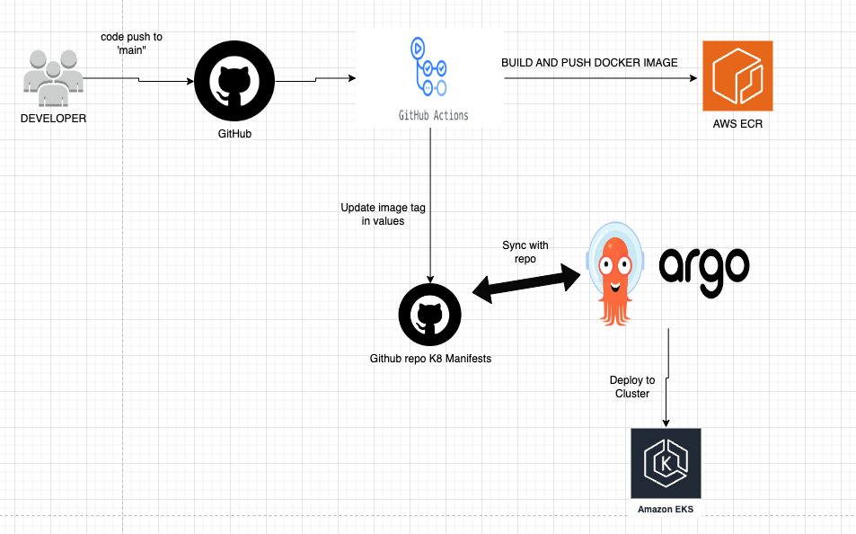

# Go Application -  GitOps in action using Kubernetes With Argo CD, Helm, GitHub Actions, and Montoring

## Introduction

This repository contains a architecture for a scalable and secure Go application with proper GitOps practices in-place.

## Description
This is a simple demo Go application, when you access '/', it returns hello.

## Directory Structure

This repository includes the following components:

1. `/app` - Contains the application code (main.go) and Dockerfile.
2. `/infra` - Infrastructure-related configuration, organized into three subfolders:

   - `/eks-terragrunt` - Terragrunt code for creating AWS infrastructure components: VPC, ECR, and EKS.
   - `/helm-charts` - Contains Helm charts for:
     - **base-chart** - The primary chart for deploying the Go application.
     - **argo-cd** - Helm chart for deploying Argo CD.
     - **monitoring-stack** - Helm chart for the monitoring setup.
   - `/argocd` - Contains configuration for Argo CD projects and applications, including:
     - `/apps` - Configuration for the app to deploy via Argo CD.
     - `/bootstrap` - Contains `root.yaml`, which automates application and project creation in Argo CD.
     - `/projects` - YAML files for Argo CD projects and ApplicationSets.
3. `.github` - Contains the GitHub Actions workflow file.

## Architecture Diagram

High Level Architecture Diagram

  

**NOTE**
- HPA is enabled on Application
- (optional) Multi-region EKS clusters could be used to support wide geographies

## Infrastructure Setup and Initial Deployment 

Please refer to this [README.md](docs/initial-setup.md) for details related to infra setup and deployment

## CI/CD

### Tools/Services used:
- Cloud: [AWS](https://aws.amazon.com/)
- Container Registry: [AWS ECR](https://hub.docker.com/)
- CI/CD Tools: [Github Action](https://github.com/features/actions) and [ArgoCD](https://argo-cd.readthedocs.io/en/stable/)

### Required Github Secrets:

- `AWS_ROLE`: Aws role arn: Required to login with AWS
- `AWS_REGION`: AWS Region
- `ECR_REPOSITORY_URI`: ECR Repo
- `GITHUB_TOKEN`: GITHUB PAT - used to push the image tag

### Automated Deployments using Github Action + ArgoCD

  

#### Workflow Functioning

- On push to supported branche (master), the new dockerimage is build for the code within `/app` directory
- Dockerimage is tagged with the latest commit hash (SHORT SHA) and is pushed to ECR
- The latest tag is updated in the values file of argocd application
- The ArgoCD will poll and identify the change in the helm charts values file and will apply the changes to EKS cluster

**NOTE**: Make sure "AutoSync" is enabled in ArgoCD for these application project

## TODO / Future Improvements
- Support HTTPS in endpoints
- Setup multiple replicas of Backend application in different nodes/zones for HA
- Support to add CI/CD for IaC (Terraform Cloud)
- Support for easier setup for Infrastructure related tools/services (ArgoCD, ExternalSecret, etc) 
- Support to add user groups/roles in auth configmap (for easier onboarding of members to EKS)
- Integrate WAF 